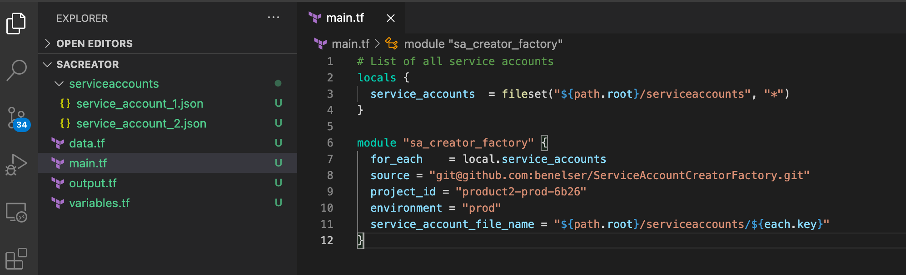

# Service Account Creator Factory 
This module is used to create and manage the full life-cycle of service accounts from terraform. The assumption is that you will be creating service accounts in a "owner-project" then granting each service account permissions (if needed across projects) to include its owner project if you choose by defining a new binding "object" {} in json property "project_level_iam_bindings" which is an array that holds our "binding objects" {}. The power comes when you start granting who has access to a Service Account as a resource which is done in the "sa_level_self_iam_bindings" property in our [json definition](./service_account_EXAMPLE.json). 

### Example of Service Account roles in which I want to apply at a project level that is not the owner project of the Service Account "Cross Project Grant"
This level is the the service account as an identity implementation this facilitates cross project access

```json
{
    "project_id": "product1-prod-b9f3",
    "project_level_roles": [
        "roles/accessapproval.approver",
        "roles/aiplatform.viewer"
    ]
}

```
### Example of Service Account Template Extension 
The module expose to values that can be used for dynamic service account creation for its owner project. This allow for re-use across projects and environments. These values are swapped out with the values that you pass into the module. The idea here is to have one definition that can be used in any environment. 
#### Template values
- project_id
- environment

```json
{
  "name": "first-sa-${environment}",
  "owner_project_id": "${project_id}",
  "display_name": "first service account",
  "description": "used for monitoring",
  "project_level_iam_bindings": [
    {
      "project_id": "${project_id}",
      "project_level_roles": ["roles/owner"]
    }
  ]
}
```
## Granting other identities access to the Service Account Resource
Remember, a service account is a identity and a resource. Above we created the SA as a resource and granted permissions to that resource. As an identity we need to define new policies to declare WHO has permissions to ACTAS that service account "AS AN IDENTITY".

### Example of defining WHO can ACTAS the Service Account
This is where the magic happens. Below is where we define who can do what with this service account as a Resource

```json
"sa_level_self_iam_bindings": [
    {
        "role": "roles/iam.serviceAccountUser",
        "members": [
            "user:belser@elsersmusings.com",
        ]
    },
    {
        "role": "roles/iam.serviceAccountAdmin",
        "members": [
            "user:belser@elsersmusings.com",
        ]
    },
    {
        "role": "roles/iam.serviceAccountTokenCreator",
        "members": [
            "user:belser@elsersmusings.com",
        ]
    }
]
```

## Instantiate Service Account Creator Factory Module
```bash
# List of all service accounts
locals {
  service_accounts  = fileset("${path.root}/serviceaccounts", "*")
}

module "sa_creator_factory" {
  for_each    = local.service_accounts
  source = "git@github.com:benelser/ServiceAccountCreatorFactory.git"
  project_id = "product2-prod-6b26"
  environment = "prod"
  service_account_file_name = "${path.root}/serviceaccounts/${each.key}"
}
```

## Consuming Project Example
Make sure you create a folder named "serviceaccounts". This is where we will keep all of our service accounts
